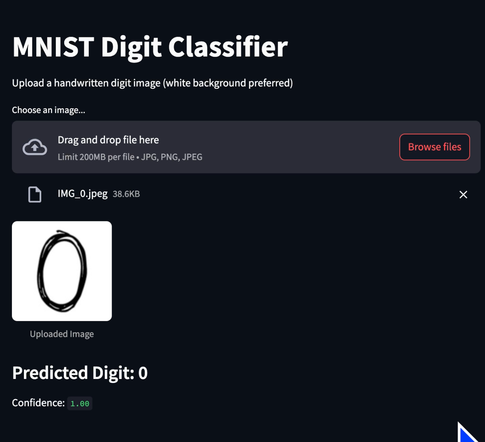

#  MNIST Classification Workflow
[](https://mnistclassificationdigits-im22fyyvmzbxcuaagd83qh.streamlit.app/)

A complete deep learning workflow for training, evaluating, and deploying a digit classifier on the MNIST dataset — with a Streamlit-powered web app for real-time image inference.


> **Example**: Model correctly classifying a handwritten "0" with 100% confidence.

---

##  Workflow Overview
```text

Load & Preprocess Data
↓
Train Multiple Models (e.g., Adam/SGD with 5/10 epochs)
↓
Log Training Curves (TensorBoard)
↓
Save Trained Models
↓
Evaluate All Models (Accuracy, Precision, Recall, F1)
↓
Save Predictions, Confusion Matrices, Metrics
↓
Compare Results (summary.csv)
↓
Pick the Best Model (✅ Adam + 10 Epochs)
↓
Analyze Errors (Wrong Predictions Images)
↓
Train with Data Augmentation (Improves Real-World Robustness)
↓
Test on Distorted & Real External Digits (e.g., photos, sketches)
↓
(Deploy / Improve / Iterate)

---

Built by Karu chan
For learning, experimentation, and real-world impact.
[👨‍💻 Github](https://github.com/khalil-hub)  
[🔗 Linkedin](https://www.linkedin.com/in/khalil-mosbah-3174a41a1/)
